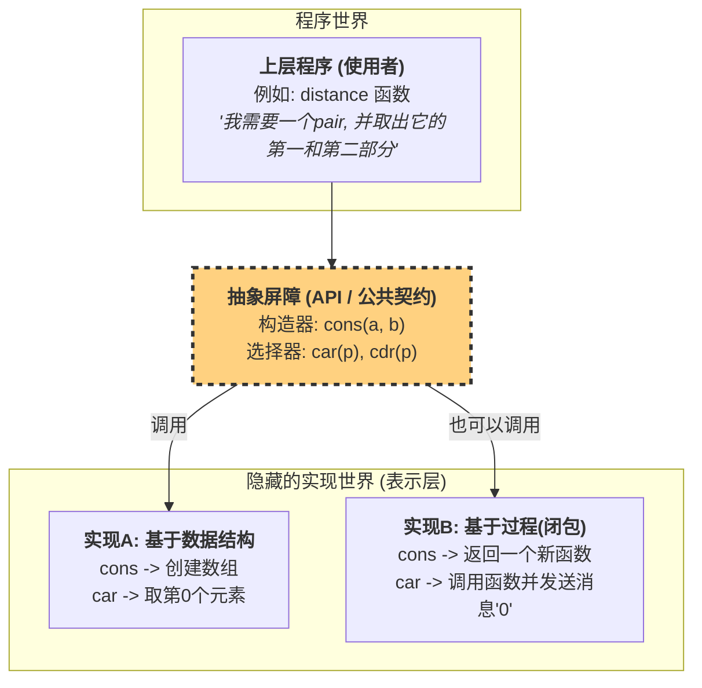

-----
### **学习笔记：数据抽象的精髓 (The Essence of Data Abstraction)**

**核心思想：**

> **将数据的使用（API）与其具体的表示（Implementation）分离开来。**

这句看似简单的话，是构建大型、可维护、健壮软件系统的基石。它意味着在“使用者”和“实现者”之间，建立起一道明确的“墙”，这道墙被称为 **抽象屏障 (Abstraction Barrier)**。

-----

#### **1. 抽象屏障的两侧**

我们可以把任何一个数据类型都想象成被这道屏障分成了两个世界：

  * **墙外 - 使用层 (Usage Layer - The API):**

      * 这是数据类型的“公共契约”或“接口”。
      * 它只关心 **“能对这个数据做什么” (What)**。
      * 它由一组定义好的操作（函数）构成，这些操作被称为**构造器 (Constructors)** 和 **选择器 (Selectors)**。
      * 使用者只需要学习并信任这个API即可，无需关心任何内部细节。

  * **墙内 - 表示层 (Representation Layer - The Implementation):**

      * 这是数据类型的“私有实现”。
      * 它关心 **“数据实际上是如何存储和操作的” (How)**。
      * 数据的具体结构（是数组、对象、还是像SICP里那样的过程）以及API函数的具体代码，都属于这一层。
      * 实现者可以自由地修改甚至完全替换这一层的代码，只要保证API的行为和契约不变。

-----

#### **2. 经典案例分析：数据对 (`pair`)**

让我们用SICP中的 `pair` 作为案例来剖析这个思想。

**A. 墙外的使用层 (API)**

`pair` 的公共契约非常简单：

  * **构造器 `cons(a, b)`**: 接受两个值，返回一个将它们捆绑在一起的“数据对”。
  * **选择器 `car(p)`**: 接受一个“数据对”，返回其中第一个值。
  * **选择器 `cdr(p)`**: 接受一个“数据对”，返回其中第二个值。

任何使用`pair`的程序，例如一个计算两点间距离的函数，它的代码只和 `cons`, `car`, `cdr` 这三个函数打交道。

```scheme
; 一个使用 pair API 的函数
(define (distance p1 p2)
  (let ((dx (- (car p1) (car p2)))
        (dy (- (cdr p1) (cdr p2))))
    (sqrt (+ (* dx dx) (* dy dy)))))
```

这个 `distance` 函数完全不知道一个`pair`在内存里长什么样。

**B. 墙内的表示层 (Implementation)**

`pair` 的内部实现可以是多种多样的，但它们都隐藏在墙后。

  * **实现方式一：常规的数据结构 (比如数组或结构体)**

      * `cons(a, b)`: 创建一个包含两个元素的数组 `[a, b]`。
      * `car(p)`: 返回数组 `p` 的第0个元素。
      * `cdr(p)`: 返回数组 `p` 的第1个元素。

  * **实现方式二：SICP展示的过程 (使用闭包)**

      * `cons(a, b)`: 返回一个接收“消息”的函数（闭包），这个闭包“记住”了`a`和`b`。
      * `car(p)`: 调用函数 `p` 并给它发送消息 `0`。
      * `cdr(p)`: 调用函数 `p` 并给它发送消息 `1`。

**关键洞察**：对于墙外的 `distance` 函数来说，无论墙内的实现是方式一还是方式二，它的代码都**完全不需要改变**，并且总能正确工作。它对 `pair` 的“信任”，仅建立在对 `cons`, `car`, `cdr` 这套API行为的信任之上。

-----

#### **3. 可视化抽象屏障**



-----

#### **4. 为什么数据抽象如此重要？**

1.  **可维护性 (Maintainability)**：如果发现某个实现有性能瓶颈或bug（比如，数组实现太慢），我们只需要在“墙内”修改或替换表示层的代码。所有使用该数据的上层程序都无需改动，极大地降低了维护成本。

2.  **模块化与解耦 (Modularity & Decoupling)**：它允许我们构建独立的、可替换的软件模块。系统的不同部分可以由不同团队开发，只要他们共同遵守API这个“契约”即可。

3.  **健壮性 (Robustness)**：它隐藏了内部细节，防止使用者意外地破坏数据的内部结构。使用者只能通过我们提供的有限且可控的API来与数据交互，保证了数据的完整性和一致性（这也被称为**封装 Encapsulation**）。

**结论**：数据抽象是一种管理复杂度的核心策略。它让我们能够构建一个可靠的系统，而不必了解系统中每个组件的所有内部工作细节，就像我们能熟练地驾驶一辆汽车，而无需成为一名内燃机工程师一样。

