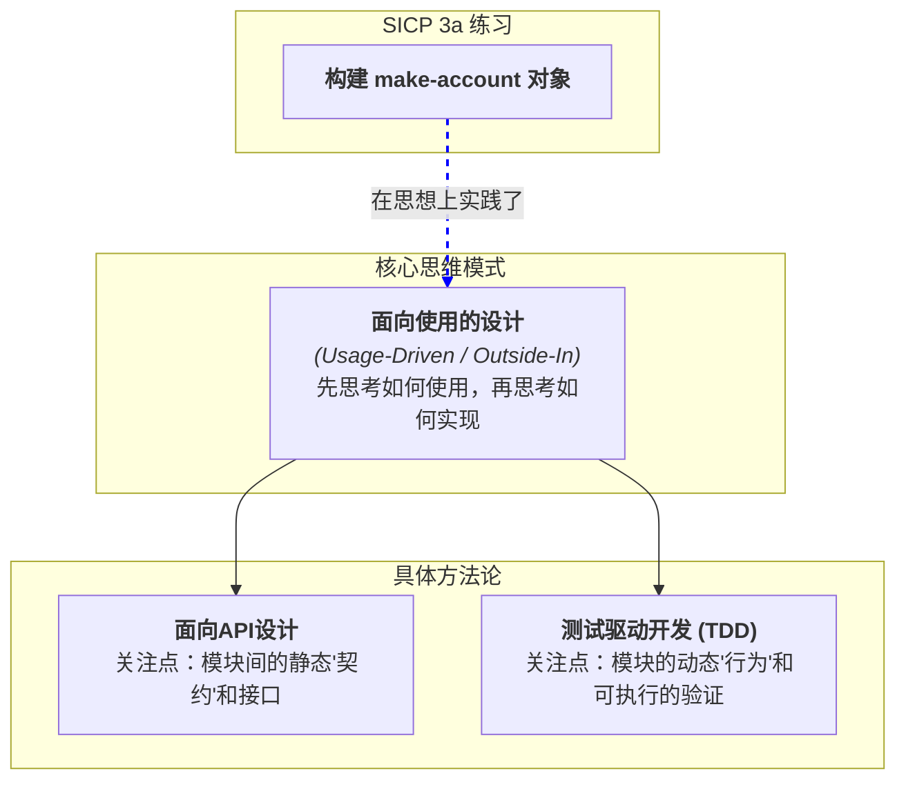

-----

### **学习笔记：从SICP练习看“面向使用”的设计哲学**

**日期**：2025年7月28日，深夜
**来源**：对SICP第3章a节状态化对象（`make-account`）编程体验的思考

#### **1. 问题的提出**

在实现SICP第3章的状态化对象时，为何会同时感受到 **“面向API编程”** 和 **“测试驱动开发(TDD)”** 的影子？这两种感觉揭示了何种共通的、更深层次的软件设计思想？

#### **2. 思想的交汇点：三种方法的精神内核**

##### **A. 面向API设计 (API-Driven Design)**

  * **核心**：“契约先行”(Contract First)。首先定义模块之间如何沟通的接口（API），然后才去实现模块内部的逻辑。
  * **在 `make-account` 中的体现**：我们首先构思并确定了“账户”这个黑盒对象对外暴露的接口——即它能接收什么样的“消息” (`'deposit`, `'withdraw`) 以及相应的参数。`  (acc 'withdraw 10) ` 本身就是一次API调用。我们先设计了这个“契约”，再去用`set!`和闭包实现它。

##### **B. 测试驱动开发 (TDD) 的精神**

  * **核心**：“红-绿-重构”循环。先编写一个失败的测试来描述期望的行为(Red)，再编写最简单的代码让测试通过(Green)，最后重构代码(Refactor)。
  * **在 `make-account` 中的体现**：虽然没有编写可执行的测试文件，但我们的**思维过程**高度模拟了TDD。我们脑中的“**思想实验**”（“我期望`(acc 'withdraw 10)`之后余额应该变成90”）扮演了TDD中“测试用例”的角色。我们编写代码的目的，就是为了让我们**对未来使用的期望**得以满足。

##### **C. 更根本的共同点：面向使用的设计 (Usage-Driven Design)**

  * **核心**：“由外而内”(Outside-In)。这是上述两种方法论共同的哲学基础。
  * **定义**：在思考一个功能**如何实现 (How)** 之前，优先思考它应该**如何被使用 (How to use)**。
  * **体现**：无论是设计API还是构思测试，我们都将自己放在了“**使用者**”或“**调用者**”的视角。我们首先关心的是模块的**外部行为和表现**，而不是其内部的实现细节。SICP的练习通过其设计，自然地引导我们进入这种思维模式。

#### **3. 关系总结与图示**

SICP的练习并非严格意义上的TDD或API设计，但它完美地实践了这两者共享的“面向使用”的核心思想。

  * **面向API设计** 更侧重于定义模块间沟通的**静态契约**。
  * **TDD** 更侧重于验证模块**动态行为**的正确性。
  * **SICP练习** 则是一场关于如何从“使用者”视角出发，构建一个行为正确的模块的**心智演练**。

<!-- end list -->

#### **4. 结论与启示**

从一个简单的编程练习中，可以提炼出指导大型软件工程的设计哲学。从“面向功能实现”的初学者思维，转变为“面向使用、面向契约”的资深工程师思维，是提升软件设计能力的关键一步。这个过程意味着：

  * **优先考虑接口的清晰性、稳定性和易用性。**
  * **通过定义清晰的行为来驱动代码的实现。**
  * **写出的代码不仅仅是能工作，更是易于理解、测试和维护的。**

-----

