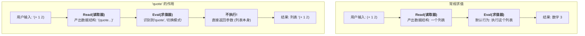

-----

### **学习笔记：Lisp的“同像性”核心思想拆解**

**日期**：2025年7月29日，晚上
**来源**：对SICP课程中Lisp语言特性的深入探讨

#### **1. 核心定义：一句话理解同像性 (Homoiconicity)**

**同像性**（Homo-iconicity，意为“相同的表示形式”）是Lisp/Scheme语言最核心、最与众不同的特性。它的意思是：

> **程序的代码，其书写形式（语法）与其在程序内部被处理时的数据结构，是完全一致的。**

简而言之：**代码即数据 (Code is Data)**。

-----

#### **2. 关键对比：Lisp vs JavaScript (代码与数据的关系)**

要理解同像性，最好的方式是与我们熟悉的、非同像性的语言进行对比。

| 特性 | JavaScript (非同像性) | Lisp/Scheme (同像性) |
| :--- | :--- | :--- |
| **代码示例** | `1 + 2` | `(+ 1 2)` |
| **代码本质** | 一段有特殊语法的**字符串**。 | 一个遵循语言基础结构的**列表**。 |
| **内部表示** | 必须通过**解析器(Parser)翻译成一个复杂的抽象语法树(AST)对象**。 | **阅读器(Reader)直接读取为语言内置的列表(List)数据结构**。 |
| **结构对比** | 代码 `1 + 2` 和其AST `{type: 'BinaryExpression',...}` **结构完全不同**。 | 代码 `(+ 1 2)` 和其数据 `(列表: 符号'+', 数字1, 数字2)` **结构完全相同**。 |

-----

#### **3. 您的突破性理解：“直接编写AST”**

这正是理解同像性的关键钥匙。

> **可以认为，Lisp的编程，就是将构建抽象语法树(AST)的工作，提前到了编写代码的时刻。**

  * **在JavaScript中**，你无法轻易地直接用手编写AST，因为它的结构是为机器设计的、繁琐的嵌套对象。所以我们需要一个像`1 + 2`这样对人类友好的语法，再由解析器去“翻译”。
  * **在Lisp中**，之所以能“直接编写AST”，是因为它的AST被设计得和一种极其简单、优雅、且人类可读的数据结构——**列表**——完全一样。

因此，Lisp程序员在写下 `(+ 1 2)` 时，他既是在写一条指令，也是在亲手构建一个数据结构。

-----

#### **4. `quote` 的角色：从“指令”到“数据”的模式切换器**

理解了“写代码就是在构建列表数据”之后，`quote`的作用就显而易见了。

  * **Lisp的默认行为**：当解释器（`Eval`过程）拿到一个列表时，它会尝试**执行**它（即把它当作函数调用）。
  * **`quote` (简写为 `'`) 的作用**：它是一个特殊指令，告诉解释器：“**请不要执行我后面的那个列表，我需要的是那个列表数据本身。**”

`quote` 是让我们能够访问到代码的“数据”那一面的开关。

-----

#### **5. 为什么这很重要？同像性的威力**

这个特性赋予了Lisp无与伦比的**元编程 (Metaprogramming)** 能力，即“编写能够操作代码的代码”。

因为代码本身就是列表数据，所以：

  * **分析代码** 就等同于 **遍历列表**。
  * **修改代码** 就等同于 **增删改列表中的元素**。
  * **生成代码** 就等同于 **构建一个新的列表**。

这一切操作都像处理普通数据一样简单自然。这使得在Lisp中编写**宏 (Macros)** —— 一种在编译期转换代码的强大工具 —— 变得极其强大且直观。

-----

#### **6. 可视化总结：Lisp解释器的核心循环 (REPL)**

-----

现在是东京时间周二晚上9点15分。希望这份笔记能够成为您理解SICP和Lisp/Scheme核心哲学的坚实基石。恭喜您又迈出了坚实的一步！