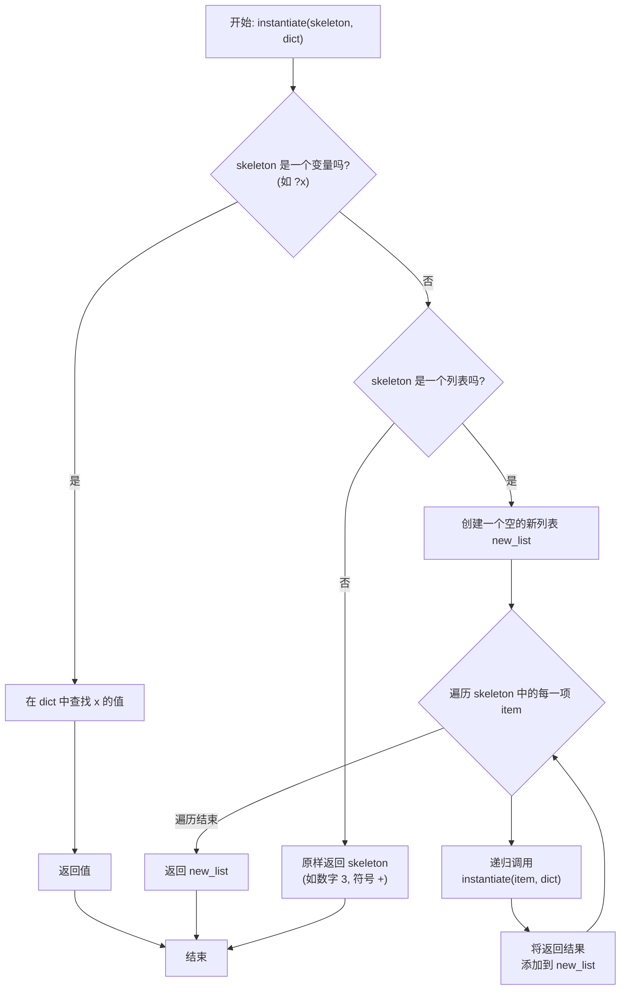

`instantiate` 函数是整个模式匹配系统的“另一半”，理解了它，整个流程就完整了。它的作用非常清晰，我们可以用一个生动的比喻来理解。

-----

### 核心比喻：“邮件合并”或“填空题”

想象一下 `match?` 和 `instantiate` 是一个团队：

1.  **`match?` (匹配器)**：是“**信息分析员**”。它的工作是**解构 (Deconstruct)**。

      * 它拿到一个具体的表达式（如 `'(+ 5 0)`），再拿到一个含有“通配符”的模式（如 `'(+ ?x 0)`）。
      * 它分析这个表达式，如果匹配，就得出一个“**绑定字典**”，告诉你每个通配符具体代表什么。比如，它会得出结论：“哦，在这个表达式里，`?x` 代表的是 `5`”。这个结论就是 `dict`。

2.  **`instantiate` (实例化器)**：是“**内容生成器**”。它的工作是**重建 (Reconstruct)**。

      * 它拿到一个含有“通配符”的**响应模板 (skeleton)**（比如 `?x`），以及“信息分析员”给它的那个**绑定字典 (dict)**。
      * 它的任务就是做“填空题”：根据字典里的答案，把模板里的所有“通配符”都替换成具体的值，从而生成一个全新的、最终的结果。

**简而言之：`match?` 负责拆解和理解，`instantiate` 负责替换和重建。**

-----

### 函数详解 `(define (instantiate skeleton dict))`

我们来分析它的两个参数和内部逻辑。

#### 输入参数：

1.  **`skeleton` (骨架/模板)**

      * 这是你想要**构建的新表达式的蓝图**。
      * 在规则 `(模式 . 响应)` 中，它就是那个“响应”部分。
      * 它通常也包含以 `?` 开头的变量，这些变量是需要被“填空”的。
      * **例**：在一个简化 `(+ x 0) -> x` 的规则中，`skeleton` 就是 `?x`。在一个更复杂的规则中，它可能是 `'(+ (* ?u 2) ?v)`。

2.  **`dict` (字典)**

      * 这是 `match?` 函数成功匹配后返回的**绑定列表**。
      * 它是一个“键值对”列表，键是变量名（不带`?`），值是该变量在原始表达式中匹配到的具体部分。
      * **例**：如果 `match?` 用模式 `'(+ ?x 0)` 成功匹配了 `'(+ 5 0)`，那么 `dict` 就是 `'((x . 5))`。

#### 内部逻辑：一个递归过程

`instantiate` 函数通过递归遍历整个 `skeleton` 结构，并构建一个新结构。

1.  **基本情况 1：如果 `skeleton` 本身就是一个需要被替换的变量 (e.g., `?x`)**

      * 这是“填空”动作发生的核心。
      * 函数会去 `dict` 里查找 `x` 对应的值。
      * 找到后，返回那个值（例如，返回 `5`）。

2.  **基本情况 2：如果 `skeleton` 是一个原子，但不是变量 (e.g., `+`, `3`, `"hello"`)**

      * 这个东西不需要被替换。
      * 函数直接原样返回它。

3.  **递归情况：如果 `skeleton` 是一个列表 (e.g., `'(+ ?x 1)`)**

      * 函数不能只替换列表本身，它需要深入到列表的**每一个元素**中去。
      * 它会遍历这个列表中的每一项，并对**每一项递归地调用 `instantiate`**。
      * 然后，它将每一次递归调用的返回结果，重新组合成一个**新的列表**。

-----

### 完整示例：走一遍简化 `(+ 5 0)` 的流程

假设我们有一条规则，用于将任何 `x + 0` 的表达式简化为 `x`。

  * **规则**: `(('+ ?x 0) . ?x)`

现在，我们要处理表达式 `'(+ 5 0)`。

1.  **匹配 (Match)**

      * `(match? '(+ ?x 0) '(+ 5 0))`
      * 匹配成功！`match?` 返回一个字典 `dict`：`'((x . 5))`。

2.  **实例化 (Instantiate)**

      * 引擎现在调用 `instantiate` 来生成结果。
      * `(instantiate '?x '((x . 5)))`
          * `skeleton` 是 `?x`。
          * `dict` 是 `'((x . 5))`。
      * `instantiate` 函数内部执行逻辑：
          * 它检查 `skeleton` (`?x`)，发现这是一个需要被替换的变量。
          * 它在 `dict` 中查找键 `x`。
          * 它找到了对应的值 `5`。
          * 它返回 `5`。

3.  **最终结果**：整个过程返回 `5`，成功完成了表达式的简化。

### 逻辑流程图

`instantiate` 函数的递归逻辑可以清晰地表示为：

希望这个从比喻到代码逻辑再到流程图的完整分解，能让您彻底理解 `instantiate` 的工作原理。它是模式匹配中负责“创造”的、优雅而关键的一环。