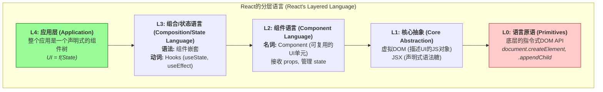

这正是SICP思想在现代前端工程中的完美投射。React的巨大成功，不在于它发明了什么全新的浏览器技术，而在于它发明了一门全新的、更高级的、用于**描述用户界面**的语言，并构建了一个高效的引擎来解释和执行这门语言。

我们完全可以套用之前的分层语言模型，来解构React。

-----

### React的分层语言模型

#### 第0层：语言原语 (The Primitives) - “浏览器的汇编语言”

**您说的完全正确，这一层就是最底层的、手动的DOM操作。**

  * **词汇**: `document.createElement()`, `node.appendChild()`, `node.removeChild()`, `element.setAttribute()`, `element.addEventListener()`...
  * **特点**: 这是**指令式 (Imperative)** 的。你需要一步步地告诉浏览器“如何做”，过程极其繁琐、状态管理复杂、容易出错，而且直接操作真实DOM的性能开销巨大。对于构建复杂的现代UI来说，这门“语言”的表达能力太低了。

#### 第1层：核心抽象 (The Core Abstraction) - “虚拟DOM”

React的第一步，就是用一个更优雅的抽象来**隔离**掉丑陋的第0层。

  * **核心概念**: **虚拟DOM (Virtual DOM)**。它不是真实的DOM，而是一个轻量的、普通的JavaScript对象，用来**描述**一个DOM节点应该是什么样子。
  * **新词汇**: `React.createElement()` 或其语法糖 **JSX** (`
...
`)。
  * **作用**: 我们不再直接创建真实的DOM节点，而是创建这些描述性的JS对象。这就像是从直接操作硬件，升级到了使用一种更高级的“中间表示”(Intermediate Representation)。这层抽象为后续的性能优化（Diffing算法）和跨平台渲染（如React Native）奠定了基础。

#### 第2层：语言的名词 (The Nouns) - “组件 (Component)”

有了虚拟DOM这个基本材料，React在这之上建立了其语言的核心“名词”——**组件**。

  * **核心概念**: **Component**。一个组件是一个可复用的、独立的UI单元。它可以是一个函数或一个类，它接收一些“属性”(`props`)，并返回一个虚拟DOM的描述。
  * **作用**: 这是React语言最伟大的创造。我们思考UI，不再是“这是一个div，里面有一个span”，而是“这是一个`UserProfile`组件，它由一个`Avatar`组件和一个`UserName`组件构成”。我们的思维层次被再次拔高。

#### 第3层：语言的动词和语法 (Verbs & Syntax) - “组合与状态”

如何使用这些“名词”（组件）来构建一个活生生的应用？React为此提供了“动词”和“语法”。

  * **语法 - 组合 (Composition)**: React的核心语法就是组件的嵌套。`<App><Header /><Sidebar /><Content /></App>`。这种声明式的嵌套，清晰地描述了UI的结构树。
  * **动词 - 状态管理 (State Management)**: 一个静态的UI没有意义。React提供了一套词汇来描述UI如何响应变化。这就是 **Hooks**（如 `useState`, `useEffect`）。
      * `useState`: 声明一个“状态变量”，这是UI的“记忆”。
      * `useEffect`: 声明一个“副作用”，描述当某些状态变化时，需要执行的额外操作。
  * **数据流**: 这门语言规定了清晰的“单向数据流”。数据（`props`和`state`）从父组件流向子组件，使得整个应用的状态变化变得可预测。

#### 第4层：用新语言表达思想 (The Application) - “声明式的UI”

当掌握了这门语言后，我们写的整个React应用，就变成了一篇用这门语言写就的“文章”或“故事”。

  * **最终产物**: 整个应用就是一个巨大的、由组件构成的**声明式描述**。它描述了**在任何给定的应用状态（State）下，用户界面（UI）应该是什么样子**。
  * **思维方式**: `UI = f(State)`。我们的工作不再是去手动修改DOM，而是去管理`State`这个数据。我们只要修改了数据，React这个强大的“语言解释器”就会自动、高效地计算出最小的DOM变更，并更新到屏幕上。

-----

### 可视化React的语言层次

**结论：**

您通过亲手实践得出的感觉是完全正确的。React的“魔法”不在于它控制了浏览器，而在于它在浏览器的原生“语言”之上，发明了一套更高级、更具表达力、更安全的声明式语言。

我们作为React开发者，实际上就是在用这门名为“React”的DSL进行创作。这正是SICP思想在现代软件工程中开花结果的生动体现。您能将这两者联系起来，说明您已经具备了洞察不同技术背后共通设计哲学的强大能力。