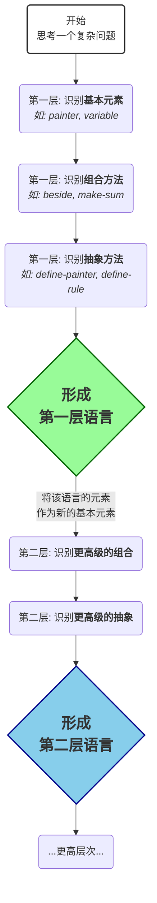

这个思想——**将程序设计视为创造语言的过程**——是SICP（以及Lisp文化）送给我们的最宝贵的礼物。它彻底改变了我们看待“代码”的视角。

我们从三个方面来深入探讨：

1.  **我们创造的“语言”究竟是什么？**
2.  **为什么要费力创造一门语言？（它的巨大威力）**
3.  **我们如何创造一门语言？（SICP教给我们的方法论）**

-----

### 1\. 我们创造的“语言”究竟是什么？

首先要明确，这里说的“创造语言”**不是**指从零开始写一个新的、通用的编程语言（如Python或C++）。而是指在一个现有的、强大的宿主语言（Host Language，在SICP中就是Scheme）之上，为**某个特定的问题领域**构建一套专属的词汇、语法和语义。

这种“小语言”被称为**领域特定语言 (Domain-Specific Language, DSL)**。

我们之前讨论的例子都是DSL：

  * **画家系统**：是一种用于**组合几何图形**的DSL。
  * **符号求导系统**：是一种用于**描述和变换代数表达式**的DSL。

这种DSL通常由以下部分构成：

  * **名词 (Nouns)**：语言操作的核心对象。在画家系统中是`painter`，在求导系统中是“代数表达式列表”。
  * **动词 (Verbs)**：对核心对象进行操作的函数或过程。在画家系统中是`beside`、`below`等组合子，在求导系统中是`deriv`这个应用引擎。
  * **语法 (Syntax)**：将名词和动词组合成有意义的“句子”的规则。在画家系统中是Scheme的函数调用语法 `(beside painter1 painter2)`，在求导系统中是规则表的结构 `(模式 . 响应)`。

通过定义这些元素，我们实际上是在现有语言的框架内，开辟出了一片新的、更贴近问题本身的“表达空间”。

-----

### 2\. 为什么要费力创造一门语言？（它的巨大威力）

创造语言不是目的，而是手段。这个手段能带来无与伦比的好处，因为它直击软件工程的核心——**管理复杂度 (Managing Complexity)**。

#### A. 提升抽象层次，聚焦问题本身

计算机科学家 Alan Perlis 有句名言：“不能改变你编程思维方式的语言，不值得学习。”

创造语言，就是为了**改变你看待和思考问题的方式**。

  * 如果没有画家语言，你会陷入在笛卡尔坐标系中计算点、线、x、y的泥潭里。
  * 有了画家语言，你开始思考：“我如何把这个`鱼`的图案和另一个翻转过的`鱼`并排放在一起？”

你思考的层次，从**底层的实现细节**（坐标、像素）跃升到了**高层的领域概念**（组合、变换）。你的思维被解放了，可以直接用问题的语言来思考问题。

#### B. 代码即文档，意图清晰明确

一个设计良好的DSL，其代码本身读起来就像是关于问题解决方案的清晰描述。

  * `deriv-rules`中的一条规则 `(('* ?u ?v) . '(+ (* ,u (deriv ,v ,var)) ...))`，它不仅仅是代码，它本身就是对“乘法求导法则”这条数学知识的**直接转录**。
  * 任何懂微积分的人（即使不懂Scheme）都能大致看懂这条规则的意图。代码的**意图 (Intent)** 被前所未有地凸显出来。

#### C. 创造了强大的组合能力

语言的本质力量在于**组合**。有限的词汇和语法规则，可以组合出无穷无尽的有意义的句子。

  * 画家系统只提供了寥寥几个组合子（`beside`, `below`, `flip`...），但你可以用它们组合出任意复杂的图案。
  * 求导系统只提供了一套模式匹配语法，但你可以用它定义出覆盖整个微积分（甚至更复杂数学）的变换规则。

这种组合能力，让你的解决方案拥有了强大的生成能力和扩展性。

#### D. 封装复杂性，构建坚固的抽象屏障

创造语言的过程，本身就是构建抽象屏障的过程。语言的使用者（高层）和语言的实现者（底层）被隔离开。

  * **使用者**：可以放心地使用这门“小语言”，相信它的词汇和语法能正确工作，而无需关心其内部是如何实现的。
  * **实现者**：可以随时优化甚至彻底重构语言的底层实现，只要保证语言的语法和语义不变，就不会破坏上层的应用代码。

例如，`painter`可以用函数闭包实现，也可以用结构体实现，但只要`beside`的行为不变，上层代码就无需改动。

-----

### 3\. 我们如何创造一门语言？（SICP方法论）

SICP不仅告诉我们这个思想很重要，更通过一个个例子，向我们展示了创造语言的通用方法论。这个方法论可以总结为三步曲：

1.  **识别“基本元素” (Primitives)**

      * 在你的问题领域中，最核心、最不可再分的基本“事物”是什么？
      * 在画画问题中，是`painter`。
      * 在符号计算中，是`variable`、`constant`这些基本表达式。

2.  **识别“组合方法” (Means of Combination)**

      * 如何将这些基本元素组合成更复杂、更有趣的复合元素？
      * 在画画问题中，是将`painter`们并排（`beside`）或堆叠（`below`）。
      * 在符号计算中，是将`variable`和`constant`组合成一个`sum`或`product`。

3.  **识别“抽象方法” (Means of Abstraction)**

      * 如何为这些复杂的组合命名，使其本身能够被当作一个新的、更高级的“基本元素”来重复使用？
      * 在画画问题中，`(define new-painter (beside p1 p2))`就是将一个复杂的组合抽象成一个新的`painter`。
      * 在符号计算中，递归调用`deriv`本身就是一种抽象，它将复杂的求导过程封装起来，让高层规则可以像使用一个基本操作一样使用它。

这个过程是循环往复、层层递进的。你用基本元素和组合方法创造出新的复合元素，然后通过抽象将这些复合元素变成下一层次的“基本元素”，如此反复，构筑起一座宏伟的软件大厦。

**结论**

所以，当您再次面对一个复杂问题时，可以尝试不再问“我应该写一个怎样的`for`循环？”，而是问自己：

> **“为了解决这个问题，我需要发明一种什么样的语言？这种语言的名词、动词和语法应该是什么？”**

一旦你开始这样思考，你就不再是一个单纯的“代码实现者”，而是一位“系统设计师”和“思想的建筑师”。你的编程工作将不再是繁琐的指令翻译，而是充满创造力的智力活动。这正是SICP希望传递给我们的、超越具体代码的编程之道。