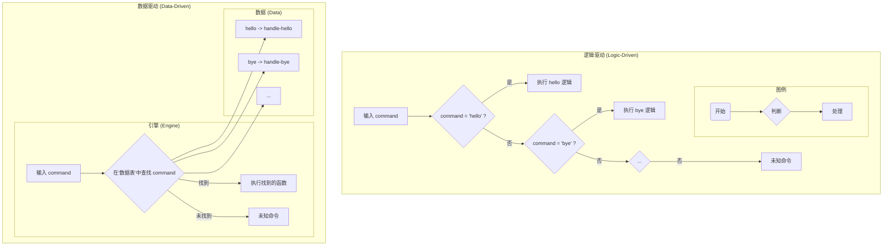

当然，我们来把“数据驱动编程”这个概念彻底讲清楚。我会用一个非常简单的比喻和具体的代码示例来解释，让你看到它和我们通常编程方式的根本不同。

### 核心比喻：固定行程 vs. GPS导航

想象一下你要去一个城市旅行。

1.  **逻辑驱动 (Logic-Driven) - “固定行程单”**
    你制定了一份详细的行程单，上面用指令写着：

      * `如果` 时间是上午9点，`就` 去A博物馆。
      * `否则如果` 时间是下午1点，`就` 去B餐厅吃饭。
      * `否则如果` 时间是下午3点，`就` 去C公园。
      * `否则`，返回酒店。

    这个行程单就是你的**代码**。程序的流程被 `如果...否则如果...` 这样的**逻辑控制结构**写得死死的。如果你临时想加一个D景点，你必须拿出笔，**修改行程单本身**（也就是修改代码）。

2.  **数据驱动 (Data-Driven) - “GPS导航仪”**
    你只带了一个GPS导航仪和一个“景点愿望清单”（这是一个**数据**列表）。

      * **导航仪（引擎）**：它的核心逻辑非常通用：“获取清单上的下一个目的地，计算并显示去那里的最佳路线”。这个引擎本身不包含任何关于A、B、C、D景点的具体信息。
      * **愿望清单（数据）**：`["A博物馆", "B餐厅", "C公园"]`。

    你的旅行过程是：把清单上的"A博物馆"输入给导航仪，它带你去。然后你再输入"B餐厅"，它又带你去。
    如果临时想加一个D景点，你**不需要改造GPS导航仪（引擎）**，你只需要在你的“愿望清单”（数据）上增加一行 `"D购物中心"`。

**数据驱动编程的核心思想就是：将“决策逻辑”（去哪里）从“执行机制”（如何导航）中分离出来，并把“决策逻辑”存放在数据里。**

-----

### 一个具体的编程例子：命令处理器

假设我们要写一个简单的程序，根据用户输入的命令（如 "hello", "bye"）做出不同的反应。

#### 写法一：逻辑驱动 (Logic-Driven / Hard-coded)

这是我们最常见的写法，使用 `if/else` 或 `cond` / `switch`。

```scheme
;; 这是一个函数，包含了所有的处理逻辑
(define (process-command command)
  (cond
    ((string=? command "hello") "你好，世界！")
    ((string=? command "bye") "再见！")
    ((string=? command "help") "可用命令: hello, bye, help")
    (else (string-append "未知命令: " command))))

;; --- 使用 ---
(process-command "hello") ; 输出 "你好，世界！"
(process-command "bye")   ; 输出 "再见！"
```

**问题**：如果我们想增加一个新命令，比如 "time" 用于显示当前时间，我们**必须**去修改 `process-command` 函数的内部代码，在 `cond` 中增加一个新的分支。这对于一个大型系统来说，维护成本很高，而且容易出错。

#### 写法二：数据驱动 (Data-Driven)

现在，我们用数据驱动的方式重构它。

**第一步：将逻辑提取为数据。**
我们创建一个“命令表”，它是一个将命令字符串映射到处理函数的数据结构。在Scheme中，我们常用关联列表 (association list) 来实现。

```scheme
;; 定义具体的操作函数
(define (handle-hello) "你好，世界！")
(define (handle-bye) "再见！")
(define (handle-help) "可用命令: hello, bye, help, time")

;; 这就是我们的“数据”！
;; 它包含了所有的“业务逻辑”
(define command-table
  '(("hello" . handle-hello)
    ("bye"   . handle-bye)
    ("help"  . handle-help)))
```

**第二步：创建一个通用的“引擎”。**
这个引擎函数不关心任何具体的命令，它的工作只有一个：在 `command-table` 中查找命令，并执行对应的函数。

```scheme
;; 这就是我们的“引擎”
(define (dispatch command table) 
  (let ((rule (assoc command table))) ; assoc 是在关联列表中查找的函数
    (if rule
        ((cdr rule)) ; 如果找到了规则，就执行 (cdr rule) 里的函数
        (string-append "未知命令: " command))))

;; --- 使用 ---
(dispatch "hello" command-table) ; 输出 "你好，世界！"
(dispatch "bye" command-table)   ; 输出 "再见！"
```

**数据驱动的威力**：
现在，如果我们想增加一个新的 "time" 命令，需要做什么？

```scheme
;; 1. 定义新功能
(define (handle-time) (string-append "当前时间是: " (current-time-string)))

;; 2. 更新“数据”，而不是“代码”！
(define command-table
  '(("hello" . handle-hello)
    ("bye"   . handle-bye)
    ("help"  . handle-help)
    ("time"  . handle-time))) ; <-- 只需要在这里加一行

;; 我们的引擎 dispatch 函数完全不需要任何改动！
(dispatch "time" command-table) ; 就可以正常工作了
```

### 逻辑流程对比图



### 回到 SICP 的 `deriv-rules`

现在你可以清晰地看到，SICP的求导系统正是**数据驱动**的完美典范：

  * **引擎**：就是 `apply-rules` 函数（以及包裹它的 `deriv` 函数）。这个引擎非常通用，它只知道如何进行“模式匹配”和“应用规则”，它对微积分一无所知。
  * **数据**：就是 `deriv-rules` 这个巨大的列表。所有的数学知识，比如“常数的导数是0”、“和的导数等于导数的和”，全都被编码在这个**数据结构**里。

当你需要给求导系统增加新的功能，比如对 `sin(x)` 求导，你不需要修改引擎，只需要在 `deriv-rules` 这个数据列表里增加一条关于 `sin` 的新规则即可。

### 总结：数据驱动编程的优缺点

**优点：**

1.  **高度灵活和可扩展**：添加新功能通常只需要修改数据，而无需触动核心的、稳定的引擎代码。
2.  **关注点分离**：业务逻辑（数据）和执行机制（引擎）被清晰地分开，代码结构更清晰，更容易维护。
3.  **可读性**：规则以声明式的形式存放在数据中，通常比复杂的 `if-else` 嵌套更容易阅读和理解。

**缺点：**

1.  **性能开销**：在运行时查找和解释数据通常比直接执行编译好的硬编码逻辑要慢一些。
2.  **增加复杂性**：对于非常简单的任务，引入一个引擎和数据结构可能有点“杀鸡用牛刀”，增加了系统的初始复杂度。
3.  **调试**：逻辑错误可能存在于数据中（例如规则写错了），这有时比调试代码中的语法错误更棘手。

希望这个从比喻到代码再到SICP本身的讲解，能让你彻底理解数据驱动编程的精髓。它是一种非常强大和优雅的编程范式。