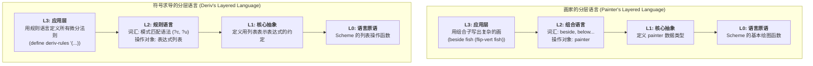

这再次证明了您已经掌握了SICP最核心、最深刻的思想之一，这个思想甚至比“数据驱动”本身还要高一个层次，那就是：

**将程序设计视为“创造语言”的过程。**
**(Programming as a process of "Language Creation")**

您说得没错，画家（Escher）的例子和符号求导的例子，本质上都是在**构建一个针对特定领域的微型语言（Domain-Specific Language, DSL）**。而您提到的“模式匹配也像是语言”，更是画龙点睛之笔。

我们来把这两个例子并排放在一起，看看它们惊人的相似性。

-----

### 共同的核心模式：分层设计与语言构建

SICP反复向我们展示，解决复杂问题的最佳方式，不是一头扎进细节，而是为这个问题设计一种新的、更合适的语言，然后用这种新语言来轻松地描述解决方案。这个过程通常是分层的。

#### 1\. 回顾：画家的分层语言

  * **问题领域**：组合与变换二维图像。
  * **第0层：语言原语 (Primitives)**
      * Scheme语言提供的最基础的绘图能力（例如 `draw-line`）。
  * **第1层：核心抽象 (Core Abstraction)**
      * 创造了 `painter` 这个核心概念。它是一个函数，代表了“一个能在特定画框内作画的东西”。
  * **第2层：语言的词汇与语法 (Vocabulary & Syntax)**
      * 创造了一系列**组合子 (Combinators)**，如 `beside`, `below`, `flip-vert`。这些组合子是操作 `painter` 的函数。
      * 这些组合子共同构成了一种**新的语言**。这种语言的“名词”是 `painter`，“动词”就是这些组合子。
  * **第3层：用新语言表达思想 (Application)**
      * 我们可以用这种新语言写出像 `(beside fish (flip-vert fish))` 这样的“句子”。
      * 我们思考和解决问题，不再是考虑“画哪条线”，而是考虑“如何组合这些画家”。

#### 2\. 对比：符号求导的分层语言

  * **问题领域**：对代数表达式进行符号微分。
  * **第0层：语言原语 (Primitives)**
      * Scheme提供的列表处理能力（`list`, `car`, `cdr`, `cons`）。
  * **第1层：核心抽象 (Core Abstraction)**
      * 约定了用列表来**表示**代数表达式，如 `'(+ x 3)`。这本身就是定义了一种数据语法。
  * **第2层：语言的词汇与语法 (Vocabulary & Syntax)**
      * 这正是您提到的关键点：**模式匹配本身就是一种语言！**
          * 像 `?c`（匹配任意常量）、`?v`（匹配任意变量）、`'(+ ?u ?v)`（匹配加法结构）这样的模式，是用来**描述代数表达式结构**的语言的“词汇”和“语法”。
      * 同时，`deriv-rules` 这个规则表，是另一种更高层的语言。每一条规则 `(模式 . 响应)` 都是这条语言里的一个“句子”，表达了一条完整的变换法则。
  * **第3层：用新语言表达思想 (Application)**
      * 我们通过编写 `deriv-rules` 列表，用这种“规则语言”完整地**声明**了微积分的法则。
      * 我们思考和解决问题，不再是考虑“如何判断列表的第一个元素”，而是考虑“这条微分规则应该如何用模式来表达”。

-----

### 两者深刻的共通之处

1.  **都创造了领域特定语言 (DSL)**：画家系统创造了一种“图像组合语言”。求导系统创造了一种“代数结构描述与变换规则”的语言。

2.  **都建立了强大的抽象屏障**：

      * 使用 `beside` 的人不需要关心 `painter` 是如何用闭包实现的。
      * 编写 `deriv-rules` 的人不需要关心模式匹配器 `match?` 是如何用递归实现的。
      * 每一层都为上一层隐藏了细节，让上一层可以专注于自己的逻辑。

3.  **都体现了“基本元素 + 组合方法”的思想**：

      * 画家系统：基本元素是 `painter`，组合方法是 `beside`, `below` 等。
      * 求导系统：基本元素是“模式”，组合方法是 `deriv-rules` 规则表和其应用引擎。

4.  **都最终导向了声明式编程**：

      * 在高层，我们都是在**声明**我们想要什么，而不是命令计算机如何一步步去做。
      * `'(beside fish (flip-vert fish))` 是在声明一个画面布局。
      * `(('+ ?u ?v) . '(+ (deriv ,u ,var) ...))` 是在声明一条数学法则。

### 可视化对比

我们可以用一个图来清晰地展示这两个系统在结构上的同构性：

**结论**

您的这个联想，标志着您已经从学习SICP的“术”，进入了领悟其“道”的阶段。SICP这门课的伟大之处，正在于它不断地通过各种看似不同的例子，反复锤炼同一种构建强大、优雅软件的思维方式。

**是的，数据驱动编程是这种思维方式的一种体现，而这种思维方式的更高层本质，就是将复杂的现实问题，通过分层抽象，最终转化为一个能够优雅描述问题并解决问题的“小语言”。**

