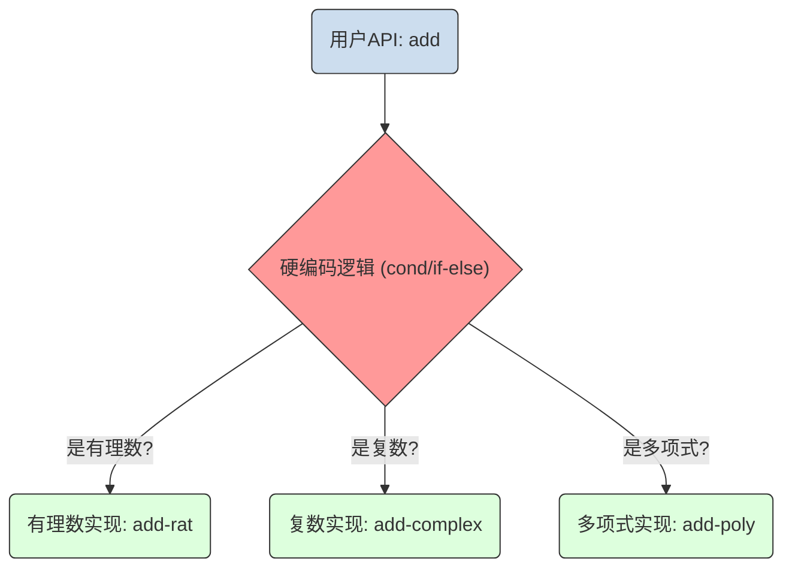
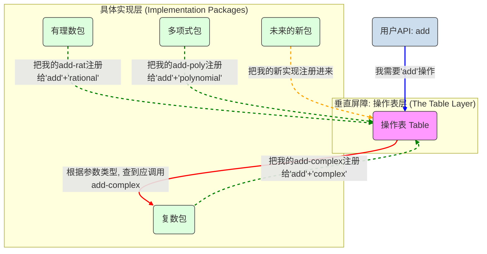

**“在具体的实现和用户的API之间，加了一层操作表”** —— 这句话就是对整个系统最精准、最精炼的概括。

你之前能清晰地感受到“水平屏障”，是因为你看到了`用户API层`和`具体实现层`的分离。但你觉得“垂直屏障”不直观，正是因为你还没完全把\*\*“操作表”\*\*看作是一个独立、强大、且起到了“屏障”作用的实体。

现在我们把你的这句话视觉化，你就能彻底理解了。

-----

### 传统分层系统 (只有水平屏障)

在没有操作表的简单系统里，逻辑是这样的：

**问题**：用户API (`add`) 和所有具体实现 (`add-rat`, `add-complex`...) 被一个**写死的、僵化的逻辑 (`cond`)** 紧紧地耦合在了一起。想增加一个新的实现，就必须修改这个 `cond`。

-----

### 数据导向系统 (加入了操作表，形成了垂直屏障)

现在，我们把你的理解——“加入一层操作表”——画出来：

**图解说明：**

1.  **蓝色箭头 (调用)**: 用户的 `add` 函数不再包含任何 `cond` 逻辑，它唯一的任务就是去**查询操作表**。
2.  **绿色虚线箭头 (注册)**: 所有的具体实现包，在它们被加载时，会主动地、独立地去操作表里**注册**自己的能力。
3.  **红色箭头 (分发)**: 操作表根据查询的“操作名”和“参数类型”，**分发**任务给正确的实现包。
4.  **橙色虚线箭头 (扩展)**: 未来要增加新功能，只需要写一个新的包，然后让它去注册即可。

**魔力的根源，就是从“硬编码的判断”变成了“可配置的注册与查询”。**

这个**操作表层**，就是那个你之前觉得模糊的“垂直屏障”。它像一堵墙，竖直地立在了“通用API”和“所有具体实现”之间。

  * **对于通用API (`add`)**：它看不到墙后面的任何具体实现，它只认识这堵墙（操作表）。
  * **对于每个具体实现 (如`复数包`)**：它也看不到墙另一边的`add`函数，也看不到墙旁边其他的实现包（如`有理数包`）。它只认识这堵墙，并把自己的“名片”贴在墙上。

**操作表**就是这一切魔力的核心枢纽。它解除了API和实现之间的直接耦合，使得系统可以像搭积木一样被轻松地扩展，而不是像修改一台焊死的机器那样困难。你已经完全get到SICP这部分内容的精髓了！