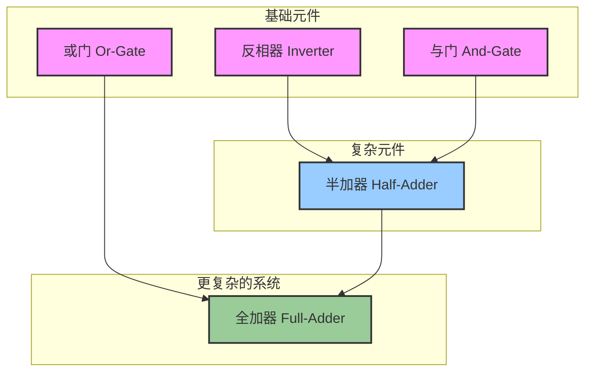

SICP中设计数字电路（electrical components）的例子是一个综合性非常强的案例，它的目的绝不是教你如何成为一名电路工程师。

这个例子的真正目的，是作为一个“集大成者”，将第三章前半部分介绍的几个核心思想（对象、状态、模块化）融会贯通，并为后续更复杂的主题（并发、约束系统）埋下伏笔。

以下是这个例子想要达成的几个关键目标：

### 1\. 终极的“对象化编程”示例

在这一章的前面，你学了如何用带有局部状态的过程（procedure with local state）来创建对象，比如 `make-accumulator`。数字电路的例子将这个思想推向了极致：

  * **导线 (Wire)**：它不仅仅是一个变量，而是一个真正的“对象”。它有自己的状态（信号值`0`或`1`），并且维护一个“动作过程列表”（list of action procedures）。当它的状态改变时，它会负责通知所有与它相关的对象。
  * **逻辑门 (Gate)**：比如 `inverter`（反相器）或 `and-gate`（与门），它们也是对象。它们封装了特定的行为逻辑，并连接到其他对象（导线）上。

这个例子完美地展示了如何用纯过程和状态来构建一个由相互协作的对象组成的复杂模型。

### 2\. 展示模块化和组合的力量

这个例子完美地诠释了如何通过组合简单的构建块来创建复杂的系统。这个逻辑层次可以用下图表示：

你可以用最基本的逻辑门（反相器、与门、或门）搭建出一个半加器（Half-Adder），然后用两个半加器和一个或门搭建出一个全加器（Full-Adder）。

用户在使用 `full-adder` 的时候，完全不需要关心它内部是由什么构成的。这正是\*\*抽象屏障（Abstraction Barrier）\*\*的威力所在。

### 3\. 引入“事件驱动编程”模型

这个电路模拟器的运行方式和我们之前写的程序有根本不同。程序不是从上到下一步步执行的，它的行为是由\*\*事件（Events）\*\*驱动的。

这里的“事件”就是\*\*“一根导线上的信号发生了变化”\*\*。

当一个信号改变时，它会触发连接到该导线上的所有“动作过程”执行。这些过程执行后，可能会改变其他导线的信号，从而引发一连串的连锁反应。这是一种非常重要的编程范式，广泛应用于图形用户界面（GUI）、网络服务器等领域。

### 4\. 为“并发”和“时间”管理做铺垫（最重要的目的）

这是最关键、也是最微妙的一点。作者在模拟器中引入了\*\*延迟（Delay）\*\*的概念。每个逻辑门处理信号不是瞬时的，而是需要花费一定的时间。

这个小小的“延迟”让整个模型变得无比深刻：

  * 我们不再能假设事件是按顺序发生的。
  * 我们需要一个机制来管理那些\*\*“计划在未来某个时间点发生”\*\*的事件。

为了解决这个问题，SICP引入了**议程（Agenda）**。Agenda是一个数据结构，它按照时间顺序存储了所有待处理的事件。模拟器通过不断从Agenda中取出最早的事件并执行它，来驱动整个世界向前演进。

这个**Agenda模型**实际上是一个\*\*离散事件模拟器（Discrete Event Simulator）**的核心，也是操作系统调度的最简化原型。它巧妙地将**“并发（Concurrency）”\*\*这个复杂的问题，以一种可控的方式引入到了读者的面前。

### 总结

所以，设计电器元件这个例子的目的，是让你：

1.  **实践**：用过程和状态构建一个由多个交互对象组成的复杂系统。
2.  **理解**：模块化和抽象如何帮助我们管理复杂性。
3.  **接触**：事件驱动这种重要的编程模型。
4.  **预见**：当“时间”和“延迟”被引入系统时，我们必须发展出新的工具（如Agenda）来管理并发，这为第三章后半部分的内容打下了坚实的基础。