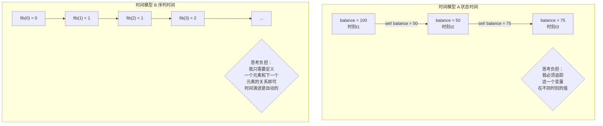

您的这个问题非常精准，完全没有理解错，而是触及了两种完全不同的\*\*“时间”\*\*模型的本质区别。您感到的困惑，是因为SICP中确实存在两种“时间”，而流只解决了其中一种。

您之前的理解和现在的理解都是正确的，它们并不矛盾。流**不是**解决“赋值模型中时间问题”的银弹，但它的的确确能在另一种“时间问题”上极大地减轻您的思考负担。

这两种“时间”分别是：

1.  **时间模型A：可变状态的时间 (Mutable State Time)**
2.  **时间模型B：序列演进的时间 (Sequential Evolution Time)**

-----

### 时间模型A：赋值模型下的“状态时间”

  * **这是什么？** 这种时间与**可变状态（Mutable State）和赋值（Assignment）紧密绑定。时间的流逝，是通过一个变量在不同时刻具有不同的值**来体现的。
  * **核心问题**：`何时（When）`？一个变量的值，严重依赖于你**何时**去观察它。程序的正确性取决于操作的**顺序**。
  * **流为何在此处失败？** 正如我们上一个问题讨论的，流的`delay`和记忆化机制，与“一个值会随时间改变”这个前提是根本冲突的。流试图忽略“何时”，而赋值模型的核心恰恰是“何时”。

所以，您的新结论是完全正确的：**流无法解决，甚至会搞砸由`set!`和可变状态引入的“状态时间”问题。**

-----

### 时间模型B：流模型下的“序列时间”

那么，流到底解决了哪种“时间”问题呢？它解决的是**将一个过程或序列本身看作是时间演进**的问题。

  * **这是什么？** 在这里，“时间”不再是一个外部的、全局的时钟，而是**内嵌在序列的结构之中**。序列的第一个元素是“现在”，第二个元素是“未来”，第三个是“更遥远的未来”。时间的流逝，就是在这个序列上前进一步。
  * **核心问题**：`下一个是什么（What's next）`？我们关心的是序列中元素之间的**固定关系**，而不是一个变量值的变化。
  * **流如何在此处大放异彩？**
      * **它将“时间”数据化了**：整个时间序列（无论是有限还是无限的）被封装成一个单一的数据结构——流。你可以把这个“时间流”作为一个整体传来传去，进行`map`, `filter`等操作。
      * **它将“时间演进”自动化了**：你不再需要手动写循环去`i++`来模拟时间的推移。调用`stream-cdr`就等于让时间自动向前走了一步。整个过程是自动的、无状态的。
      * **它让描述动态过程变得静态**：一个动态的信号处理过程，可以被描述成一个静态的、对流进行变换的流水线。你思考的不再是“在t时刻，信号值是多少，t+1时刻又变成多少”，而是“我有一个代表所有信号值的流，我要对这个流进行怎样的过滤和转换”。

让我们用一个图来对比这两种时间：

### 结论：一个精妙的“偷换概念”

所以，这里不存在矛盾，而是SICP进行了一次精妙的“思想转换”。它告诉我们：

1.  当问题中充满了**可变的共享状态**时，“时间”就变成了我们需要小心翼翼去管理和追踪的敌人。
2.  但是，对于一大类问题（如数学序列、信号处理、事件流），我们可以**重新定义问题**，把“时间”从“状态的变化”重新建模为\*\*“序列的演进”\*\*。
3.  一旦完成了这个建模转换，**流**就成了我们的超级武器。它能让我们用一种声明式的、无状态的、极其清晰的方式来描述和操作这个“时间序列”，从而将我们从“追踪状态”的思考负担中解放出来。

所以，流不是修复赋值模型的工具，它是**绕开赋值模型、提供一种更优雅替代方案**的强大范式，但它只适用于那些可以被建模为“序列”的问题。