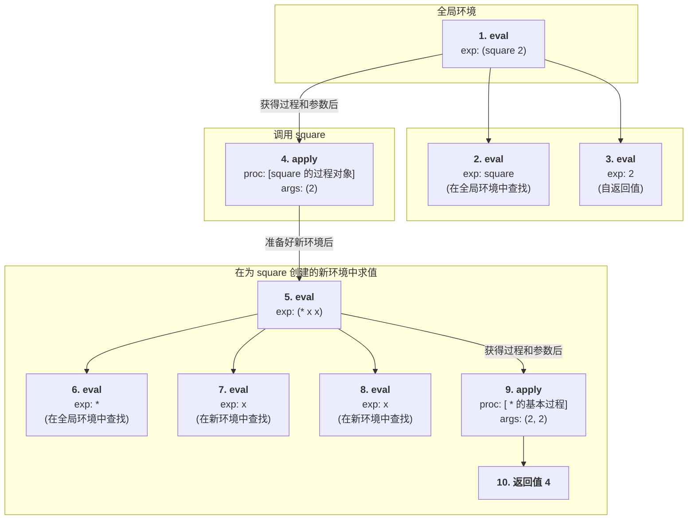

我们就以一个非常经典的例子来分析：

假设我们已经定义了 `square` 函数：
`(define (square x) (* x x))`

现在，我们要用元循环求值器来计算表达式：**`(square 2)`**

### 前提条件

在求值开始前，我们的**全局环境**中必须已经有 `square` 和 `*` 的定义。

  * `*`：绑定到一个**基本过程**（Primitive Procedure），可以执行乘法。
  * `square`：绑定到一个**复合过程**（Compound Procedure），这个过程对象包含了：
      * 参数 (parameters): `(x)`
      * 函数体 (body): `(* x x)`
      * 定义时的环境 (environment): `全局环境`

### 求值过程树形图

下面的树形图展示了求值 `(square 2)` 的完整调用流程。序号代表了执行的先后顺序，每个节点都标明了是 `eval` 还是 `apply`。

### 详细步骤分解

让我们跟着序号，一步步地“扮演”这个求值器：

1.  **`eval((square 2), 全局环境)`**

      * `eval` 看到这是一个组合式（过程调用）。
      * 它的任务是：1) 求值操作符 `square`，2) 求值操作数 `2`，3) 将结果交给 `apply`。

2.  **`eval(square, 全局环境)`**

      * `eval` 看到 `square` 是一个变量。
      * 它在全局环境中查找 `square`，找到了与之绑定的**复合过程对象**（就是我们前提里说的那个）。它返回这个对象。

3.  **`eval(2, 全局环境)`**

      * `eval` 看到 `2` 是一个数字（自求值表达式）。
      * 它直接返回值 `2`。

4.  **`apply([square 过程], (2))`**

      * 现在 `eval` (在步骤1) 已经收集齐了**过程**和**参数列表(2)**。它调用 `apply`。
      * `apply` 检查发现这是一个**复合过程**。
      * **关键操作**：`apply` 创建一个**新的环境 `E'`**。这个新环境继承了 `square` 过程对象里保存的全局环境，并且在新环境中将参数 `x` 绑定到值 `2` 上。
      * 然后，`apply` 将 `square` 的函数体 `(* x x)` 和这个新环境 `E'` 交给 `eval` 去执行。

5.  **`eval((* x x), E')`**

      * `eval` 现在在一个全新的环境 `E'`（其中 `x` 是 `2`）里工作。
      * 它看到 `(* x x)` 又是另一个组合式。于是重复步骤1的逻辑。

6.  **`eval(*, E')`**

      * 在 `E'` 中查找变量 `*`。`E'` 中没有，于是顺着环境链向上，在全局环境中找到了 `*` 绑定的**基本过程**。返回这个基本过程。

7.  **`eval(x, E')`**

      * 在 `E'` 中查找变量 `x`。找到了！它被绑定为 `2`。返回值 `2`。

8.  **`eval(x, E')`**

      * 同上，返回值 `2`。

9.  **`apply([* 的基本过程], (2, 2))`**

      * `eval` (在步骤5) 再次收集齐了**过程**和**参数列表(2, 2)**，并调用 `apply`。
      * `apply` 检查发现这是一个**基本过程**。
      * 它直接调用宿主语言的乘法功能，计算 `2 * 2`。

10. **返回值 4**

      * `apply` (在步骤9) 返回计算结果 `4`。
      * 这个值 `4` 逐层返回：
          * 返回给 `eval` (步骤5)。
          * `eval` (步骤5) 将 `4` 返回给 `apply` (步骤4)。
          * `apply` (步骤4) 将 `4` 返回给 `eval` (步骤1)。
      * 最终，整个表达式 `(square 2)` 的求值结果就是 `4`。

