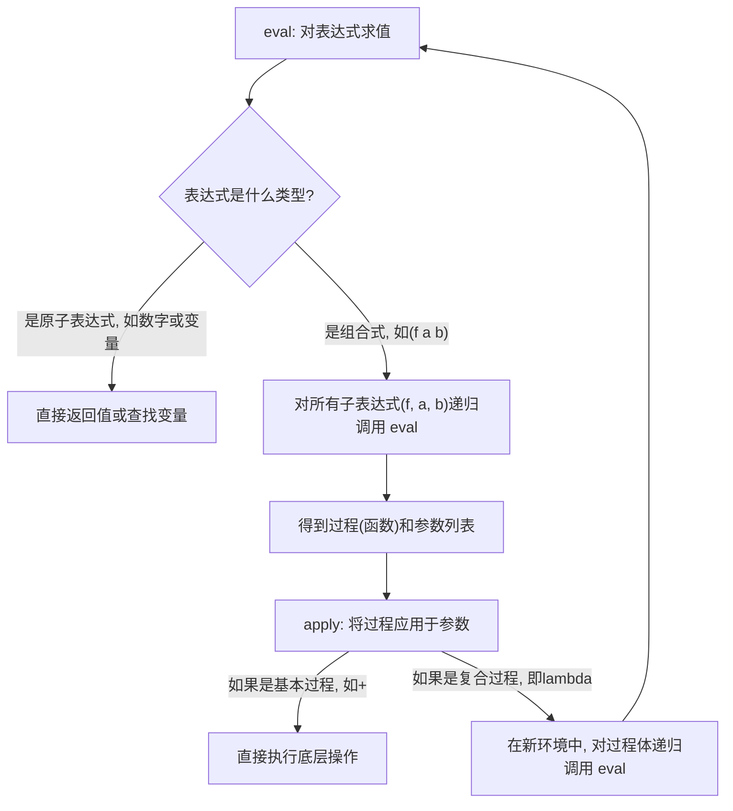

**元循环求值器（Metacircular Evaluator）** 是一个用 **Scheme 语言自身**来解释（或称为“求值”）**Scheme 表达式**的程序。

我们可以从它的名字来理解它的精髓：

1.  **求值器（Evaluator）**：
    它的本质是一个**求值器**。求值器的作用就是接收一段程序代码（作为输入），然后分析并执行它，最后得出结果。我们平时在 Scheme 环境里输入 `(+ 1 2)` 然后得到 `3`，就是求值器在背后工作。

2.  **元（Meta）**：
    “元”意味着“关于自身”。这个求值器是关于“求值”这个过程本身的。它将程序代码（例如 `(+ 1 2)` 这个列表）看作是普通的数据，然后根据一套规则来处理这些数据，模拟计算机执行代码的过程。这是一种**元语言抽象**（Metalinguistic Abstraction）的体现，即我们创造了一种“语言”（求值器本身）来描述另一种语言（Scheme）。

3.  **循环（Circular）**：
    “循环”指的是这个求值器所使用的**实现语言**和它所要**解释的语言**是同一种，即 Scheme。这就构成了一个有趣的“自举”或“循环”定义：

    > 我们用 Scheme 写了一个程序，这个程序的功能是解释执行 Scheme 程序。

**一个简单的类比：**

想象一下，你用**中文**写了一本《中文语法指南》。

  * **指南本身**是用**中文**写的（实现语言）。
  * **指南所描述和解释的对象**也是**中文**（目标语言）。

这就是一种“元循环”的结构。元循环求值器也是如此，它用 Scheme 语言，清晰地定义了 Scheme 语言自身的求值规则。

### 元循环求值器的核心思想

元循环求值器的核心由两个相互协作的组件构成：`eval` 和 `apply`。

  * `eval`: 负责接收一个**表达式**和一个**环境**，并对表达式进行求值。它会分析表达式的类型（是数字、是变量，还是一个组合式等），然后进行相应的处理。
  * `apply`: 负责将一个**过程**（函数）应用到一组**实际参数**上。当 `eval` 遇到一个需要执行函数调用的表达式时，就会调用 `apply`。

这两个过程相互递归调用，构成了整个求值器的基本循环。我可以用一个 Mermaid 图来简单展示它们的关系：

### 学习它的意义是什么？

在 SICP 中学习元循环求值器，主要目的**不是**为了构建一个真正高性能的解释器，而是为了：

1.  **揭示魔法**：让你彻底明白编程语言的解释过程到底是如何工作的，打破“代码如何运行”的神秘感。
2.  **掌握核心概念**：深入理解环境、作用域、闭包、求值策略等关键概念。
3.  **获得强大能力**：一旦你理解了求值器，你就可以修改它，从而改变这门语言的行为，甚至创造出你自己的编程语言！这正是第四章标题“元语言抽象”的真谛。

简单来说，**元循环求值器是一个用 Scheme 编写的、能够解释运行 Scheme 代码的程序，它是我们理解语言工作原理的一面“镜子”。**