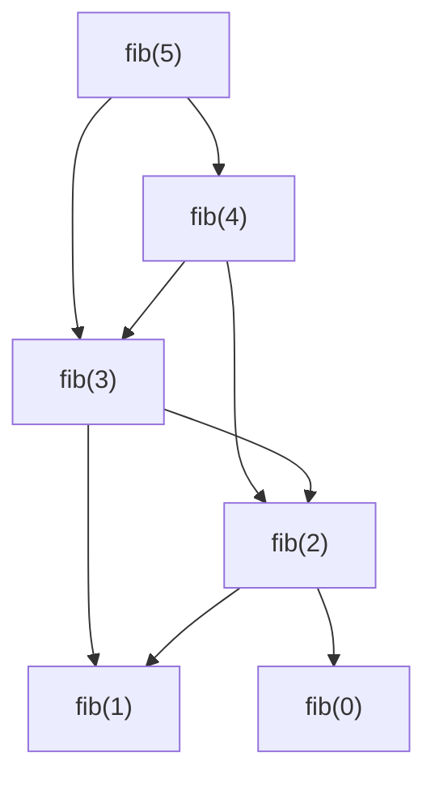

好的，我们顺着这条线索继续往下看。在讲完 GCD（尾递归/循环）和阶乘（线性递归/栈）之后，斐波那契（Fibonacci）的例子又将复杂度提升到了一个新的层次。

斐波那契例子主要是在讲**如何处理“树状递归” (Tree Recursion)**。

这是一个比阶乘的线性递归更复杂的模式，它要求我们的寄存器机器和栈机制能够处理一个调用链路中存在**多个（而不是一个）分支和返回**的情况。

-----

### 1\. 为什么阶乘的例子还不够？

我们回顾一下阶乘 `(factorial n)` 的计算过程：
它需要计算 `(* n (factorial (- n 1)))`。这里只有一个递归调用 `(factorial (- n 1))`。当这个子问题算完返回后，只需进行一次乘法，整个过程就结束了。这是一种**线性**的调用链。

`fact(5) -> fact(4) -> fact(3) -> fact(2) -> fact(1)`

但斐波那契数列不同：
`  (fib n) ` 的计算需要 `(+ (fib (- n 1)) (fib (- n 2)))`。
这里有两个递归调用！这意味着计算过程会像一棵树一样分叉开来。

这个树状结构对我们的机器提出了新的、更严峻的挑战。

### 2\. 斐波那契例子到底讲了什么？

它用一个具体的例子，展示了我们用 `save` 和 `restore` 建立起来的“调用/返回”机制，是**足够强大**的，完全可以处理这种复杂的树状递归。

它实际讲解了以下核心内容：

1.  **处理第一个递归分支 `(fib (- n 1))`**

      * 这部分和阶乘例子非常相似。
      * **调用前**:
        1.  `save n`：保存当前的 `n`，因为计算完 `fib(n-1)` 后，我们还需要它来计算 `fib(n-2)`。
        2.  `save continue`：保存返回地址。这个返回地址非常关键，我们称它为 `after-fib-n-1`。它指向的代码，是**计算 `(fib(-n-1))` 之后**该干的事情。
        3.  将 `n` 减 1，然后 `goto` 到 `fib-loop` 开始计算 `fib(n-1)`。

2.  **处理两个分支间的状态**

      * **`fib(n-1)` 计算完成后**，程序会返回到 `after-fib-n-1`。
      * 此时，`val` 寄存器里存放着 `fib(n-1)` 的结果。
      * 我们**不能立刻**进行加法，因为我们还没有 `fib(n-2)` 的值。
      * **关键操作**：必须把 `fib(n-1)` 的结果（也就是 `val` 寄存器的值）**也保存到栈里**！因为它是一个中间结果，马上要被第二次递归调用覆盖。

3.  **处理第二个递归分支 `(fib (- n 2))`**

      * **调用前**:
        1.  `restore n`：恢复 `n` 的原始值。
        2.  `save val`：将 `fib(n-1)` 的结果压入栈中。
        3.  `save continue`：再次保存返回地址，我们称之为 `after-fib-n-2`。这是**计算完 `(fib(-n-2))` 之后**该干的事情。
        4.  将 `n` 减 2，然后 `goto` 到 `fib-loop` 开始计算 `fib(n-2)`。

4.  **最终的合并与返回**

      * **`fib(n-2)` 计算完成后**，程序会返回到 `after-fib-n-2`。
      * 此时，`val` 寄存器里是 `fib(n-2)` 的结果。
      * **关键操作**：
        1.  用 `restore` 从栈里取出之前保存的 `fib(n-1)` 的值，我们可以把它存到一个临时寄存器里（比如 `n`，因为 `n` 的原始值已经用完了）。
        2.  现在，我们同时拥有了 `fib(n-1)` 和 `fib(n-2)` 的值，执行加法操作。
        3.  `restore continue`：恢复**最初的调用者**所设置的返回地址，并跳转回去。

### 总结

**斐波那契例子是对“栈”这种机制的一次压力测试。** 它证明了：

  * **栈可以保存多层、多个中间状态**：不仅仅是调用者的 `n`，连第一个子问题的计算结果 `fib(n-1)` 也能被暂存起来。
  * **`save/restore` 机制是通用的**：无论递归结构多复杂，只要遵循“调用前保存，返回后恢复”的原则，就能保证计算的正确性。
  * **为求值器做好了最终准备**：Scheme 求值器本身就是一个巨大的树状递归程序（例如，对 `(+ a b)` 求值，需要分别对 `+`, `a`, `b` 进行求值）。Fibonacci 例子中对两个分支的管理，完美地模拟了求值器对组合式 `(operator operand1 operand2 ...)` 的处理方式。

**一句话概括：**

  * **GCD** 讲了**循环**。
  * **阶乘**讲了**线性递归**和**栈的基本用法**。
  * **斐波那契**讲了**树状递归**和**栈的高级用法（处理多个分支和中间结果）**。

走完这三步，你就已经掌握了用最底层的指令去实现任何复杂度的递归算法所需的全部核心思想。你已经准备好去挑战本章的最终 Boss——显式控制求值器 (Explicit-Control Evaluator) 了。