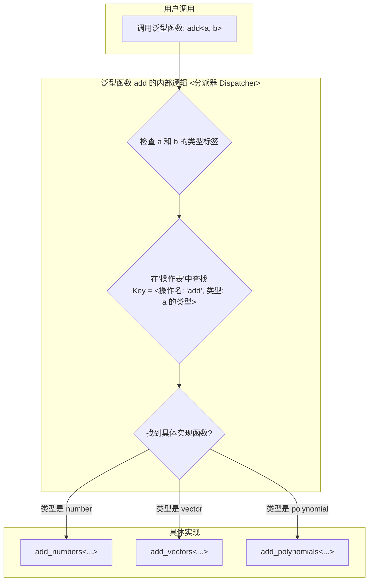

SICP中展示的这个概念是现代编程语言中 **Trait / Interface / Typeclass** 系统的思想源头之一。

这个核心思想叫做 **泛型操作 (Generic Operations)** 或者说 **多态 (Polymorphism)**。它的目标是让我们编写的函数（比如 `+` 和 `*`）不依赖于某个具体的数据类型，而是依赖于一个抽象的 **行为** 或 **契约**。

让我们深入剖析一下这个思想，以及它在SICP和Rust中是如何体现的。

-----

### 1\. SICP中的思想：数据导向的编程 (Data-Directed Programming)

在SICP中，当提到 `(* x (+ a b))` 可以处理数字、向量、多项式时，它背后并没有语言内置的trait系统。SICP的作者是在教你 **如何从零开始构建这样一个系统**。这种技术在书中被称为“数据导向的编程”。

它的实现机制大致如下：

1.  **类型标记 (Type Tagging)**：首先，每种数据结构都需要有一个“标签”来标识自己的类型。比如，一个向量可能会被表示为 `(vector 1 2 3)`，其中 `vector` 就是它的类型标签。

2.  **操作表 (Table of Operations)**：系统内部会维护一个二维的“操作表”（通常用哈希表或关联列表实现）。这个表用来存储“哪种操作”作用于“哪种类型”时，应该调用“哪个具体函数”。

| 操作 (Operation) | 类型 (Type)     | 具体实现函数 (Procedure) |
| :--------------- | :-------------- | :----------------------- |
| `add`            | `number`        | `add-numbers`            |
| `add`            | `vector`        | `add-vectors`            |
| `add`            | `polynomial`    | `add-polynomials`        |
| `multiply`       | `number`        | `multiply-numbers`       |
| `multiply`       | `polynomial`    | `multiply-polynomials`   |

3.  **泛型分派 (Generic Dispatch)**：当你调用一个泛型函数，比如 `add(a, b)` 时，这个函数并不包含加法逻辑。它的工作是：
    a. 检查 `a` 和 `b` 的类型标签（比如是 `number` 还是 `vector`）。
    b. 根据操作名 (`add`) 和类型标签去“操作表”里查找对应的具体实现函数。
    c. 找到后，调用那个具体的函数（比如 `add-vectors`）。

这个过程可以用下图来表示：



**SICP方式的特点**：

  * **核心思想**：将“操作”与“数据”分离，通过一个中间层（分派器和操作表）来连接它们。
  * **优点**：非常灵活。你可以在程序运行时动态地添加新的数据类型或新的操作，只需要向操作表里注册即可。
  * **缺点**：这是在 **运行时** 进行的。如果调用了一个没有实现的操作（比如两个向量相乘），程序只有在运行到那一行时才会报错。这是动态语言的典型特征。

-----

### 2\. Rust中的实现：Trait (特质)

Rust 语言将上述思想内置到了其核心，并把它从“运行时”的动态机制，升级为了“编译时”的静态机制。这就是 **Trait**。

**Trait** 本质上是一个 **行为的契约**。它定义了一组方法签名，任何数据类型只要实现了这个Trait，就等于承诺自己拥有这些行为。

让我们看看`+`操作在Rust里是怎么回事。当你写 `a + b` 时，这其实是 `a.add(b)` 的语法糖。这个 `add` 方法就定义在 `std::ops::Add` 这个Trait里。

```rust
// 这是 std::ops::Add Trait 的简化定义
pub trait Add<Rhs = Self> {
    type Output; // 关联类型，指定相加后的结果类型

    // 这个 trait 要求实现一个名为 add 的方法
    fn add(self, rhs: Rhs) -> Self::Output;
}
```

现在，我们可以为不同的数据类型实现这个“契约”：

**为向量实现 `Add` Trait:**

```rust
#[derive(Debug, PartialEq)] // 为了方便打印和比较
struct Vector {
    x: f64,
    y: f64,
}

// 为 Vector 实现 Add Trait
impl std::ops::Add for Vector {
    type Output = Self; // Vector + Vector = Vector

    fn add(self, other: Self) -> Self::Output {
        Vector {
            x: self.x + other.x,
            y: self.y + other.y,
        }
    }
}
```

**编写一个泛型函数:**

现在我们可以写一个泛型 `sum` 函数，它能对任何实现了 `Add` Trait 的类型进行操作。

```rust
// T: std::ops::Add<Output = T> 是一个 Trait Bound (Trait约束)
// 它告诉编译器：T 必须是实现了 Add Trait 的类型，并且其加法输出类型也是 T
fn sum<T: std::ops::Add<Output = T>>(a: T, b: T) -> T {
    a + b // 编译器知道 T 有 .add() 方法，所以这行代码是合法的
}

fn main() {
    // 对数字使用
    println!("Sum of numbers: {}", sum(5, 10)); // 输出 15

    // 对我们自己定义的向量使用
    let v1 = Vector { x: 1.0, y: 2.0 };
    let v2 = Vector { x: 3.0, y: 4.0 };
    println!("Sum of vectors: {:?}", sum(v1, v2)); // 输出 Vector { x: 4.0, y: 6.0 }
}
```

**Rust方式的特点**：

  * **核心思想**：通过Trait定义抽象行为，数据类型通过实现Trait来获得该行为。
  * **优点**：**类型安全** 和 **高性能**。
      * **编译时检查**：如果你尝试 `sum` 两个不兼容的类型，或者一个没有实现 `Add` 的类型，程序根本无法通过编译。这在编译阶段就消除了大量的潜在错误。
      * **静态分派**：在大多数情况下，编译器在编译时就已经确切地知道应该调用哪个具体函数（比如 `Vector` 的 `add`），并直接将调用内联或替换，没有任何运行时的查找开销。这被称为“静态分派”。
  * **缺点**：相比SICP的动态方式，灵活性稍低。所有类型和实现必须在编译时是已知的。

### 总结：思想的演进

您的联想非常深刻，因为它揭示了编程语言设计思想的演进：

| 特性     | SICP (数据导向编程)                                 | Rust (Trait 系统)                                     |
| :------- | :-------------------------------------------------- | :------------------------------------------------------ |
| **本质** | 在动态语言中 **手动构建** 的一个泛型分派系统        | **内置于语言核心** 的、编译时检查的泛型系统             |
| **检查** | **运行时 (Runtime)** | **编译时 (Compile-time)** |
| **安全** | 较低，错误在运行时暴露                            | 极高，大部分类型错误在编译时就被捕获                    |
| **性能** | 较低，有运行时查找和分派的开销                      | 极高，通常是零成本抽象（静态分派）                      |
| **关系** | **思想的源头和教学原型** | **思想的现代、高效、安全的工业级实现** |

SICP教给你的是最根本的、不依赖于任何特定语言功能的思想——“如何组织数据和程序来实现多态”。而Rust则向你展示了如何将这种思想固化为语言的核心特性，从而在获得强大抽象能力的同时，不牺牲任何安全性和性能。